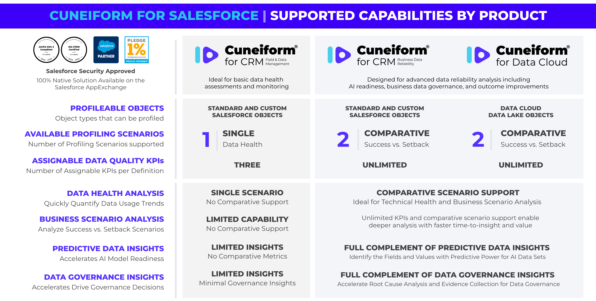

# Creative Commons Attribution-NonCommercial 4.0 
International (CC BY-NC 4.0)

### About Cuneiform for Salesforce
[Cuneiform for Salesforce](https://jira-peernova.atlassian.net/wiki/spaces/CFCPD/pages/2623373382/Introducing+Cuneiform+for+Salesforce) is a product line consisting of multiple Salesforce appExchange solutions that help Salesforce customers unlock the full potential of their Salesforce data.  Customers use our products to gain insights from their business data that confidently accelerate data quality, business data governance, and business outcome decisions. Our products include:

- [Cuneiform for CRM: Field and Data Management](https://appexchange.salesforce.com/appxListingDetail?listingId=a0N4V00000IPSsZUAX).  Ideal for basic data health assessments and monitoring.
- [Cuneiform for CRM: Business Data Reliability](https://appexchange.salesforce.com/appxListingDetail?listingId=dcdc9a6e-7260-45b7-ab1b-ebae40e5e9b7).  Designed for advanced data reliability analysis including
  AI readiness, business data governance, and outcome improvements.
- [Cuneiform for Data Cloud](https://appexchange.salesforce.com/appxListingDetail?listingId=9684ab30-77cb-4ee1-bd3d-ee24725cc9cd).  Bringing all of our Business Data Reliability features to Salesforce Data Cloud.

> Use this chart to review the capability differences across our products.  Please note that [Cuneiform for CRM: Field and Data Management](https://appexchange.salesforce.com/appxListingDetail?listingId=a0N4V00000IPSsZUAX) is free -- and our other products are paid upgrades from our free product.

> Please visit our [Legal Agreements](https://jira-peernova.atlassian.net/wiki/spaces/CFCPD/pages/2774335631/Legal+Agreements+and+Notices) page to view the agreements that govern access to and usage of our products.

### About The Reports in this Repository
The reports in this repository serve as foundational templates to help you get started with Cuneiform for Salesforce. They are designed to be customized and adapted to meet your organization's specific needs.

#### You Are Free To
- **Share**, copy, and redistribute the material in any medium or format
- **Adapt**, remix, transform, and build upon the material

#### Under the Following Terms
- **Attribution**.  You must give appropriate credit, provide a link to the license, and indicate if changes were made. You may do so in any reasonable manner, but not in any way that suggests the licensor endorses you or your use.
- **NonCommercial**.  You may not use the material for commercial purposes.
- **No Additional Restrictions**.  You may not apply legal terms or technological measures that legally restrict others from doing anything the license permits.

For full details, visit https://creativecommons.org/licenses/by-nc/4.0/

### This License Does Not Apply To Our Cuneiform for Salesforce Products

This license only applies to the custom reports found in this repository.  It does not apply to any of the products in the Cuneiform for Salesforce product line.  Our products are governed by separate legal agreements that you must accept before using them.
> Please visit our [Legal Agreements](https://jira-peernova.atlassian.net/wiki/spaces/CFCPD/pages/2774335631/Legal+Agreements+and+Notices) page to review the legal agreements that govern access to and usage of our [Cuneiform for CRM: Field and Data Management](https://appexchange.salesforce.com/appxListingDetail?listingId=a0N4V00000IPSsZUAX), [Cuneiform for CRM: Business Data Reliability](https://appexchange.salesforce.com/appxListingDetail?listingId=dcdc9a6e-7260-45b7-ab1b-ebae40e5e9b7), and [Cuneiform for Data Cloud](https://appexchange.salesforce.com/appxListingDetail?listingId=9684ab30-77cb-4ee1-bd3d-ee24725cc9cd) Salesforce appExchange products.
