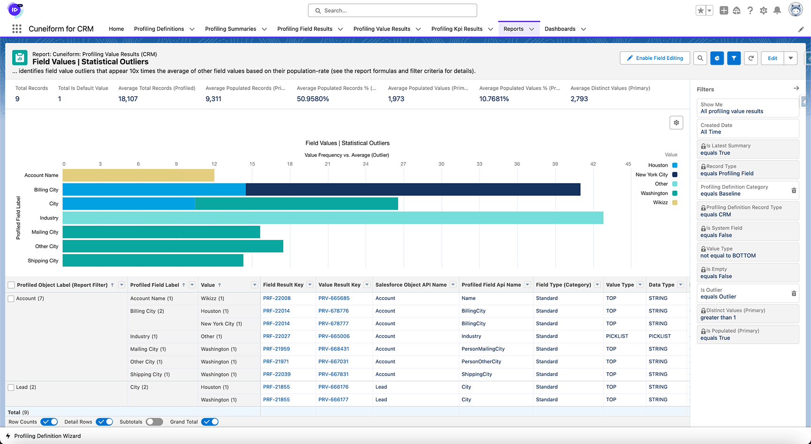
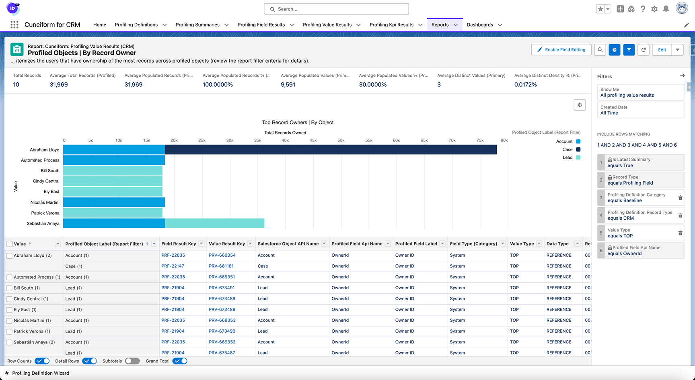

# cuneiformsf-reports-datahealth

## Free Data Health Reports for Salesforce Customers
Powered by [Cuneiform for Salesforce](https://jira-peernova.atlassian.net/wiki/spaces/CFCPD/pages/2962358316/PeerNova+s+Cuneiform+for+Salesforce+Products).  Over 110+ Salesforce Reports across 17 Data Health and Reliability Categories. 100% Free for the Salesforce ecosystem.


This repository manages our collection of thoughtfully curated data quality and technical health reports.  Each of the reports in this collection provides a specific set of insights into your Salesforce data and can be customized to meet your specific data quality needs.  

- Use these reports with any Cuneiform for Salesforce product to help you get started with your data quality journey.
- Use these reports to explore the shape, health, and reliability, and usage trends of your Salesforce data.
- Customize, extend, and adapt these reports to meet your organization's specific needs. 

> [Install Cuneiform for CRM today](https://jira-peernova.atlassian.net/wiki/spaces/CFCPD/pages/2956001507/Setup+Field+and+Data+Management) and start profiling your Salesforce and Data Cloud objects.

## What Is Cuneiform for Salesforce?

[Cuneiform for Salesforce](https://jira-peernova.atlassian.net/wiki/spaces/CFCPD/overview) is the Salesforce ecosystem's first line of high-performance data quality, data reliability, and data management products for Salesforce CRM and Data Cloud.  

Use our products to quickly profile the CRM and Data Cloud objects that power your business outcomes -- and do this [securely from within your Salesforce org](https://jira-peernova.atlassian.net/wiki/spaces/CFCPD/pages/2625699908).  Leverage these reports and our collection of utilization and metadata profiling insights to assess the technical health and shape of your data (up to millions of records).  


> Follow our [Data Quality and Business Impact KPIs](https://jira-peernova.atlassian.net/wiki/spaces/CFCPD/pages/2731769918/Extending+Profiling+with+Data+Reliability+KPIs) approach to drive data quality initiatives by correlating data quality statistics to business outcomes.

## Data Health Report Categories
Our Data Health reports offer actionable insights into key data health metrics -- such as duplicate value detection, picklist usage, data governance gaps, default value usage, outlier value detection, and field utilization,  By using these reports, Salesforce professionals can drive more informed org management decisions, enhance data governance strategies, and ensure their data is optimized for business processes.

| Report Category                                                                               | Reports | Description                                                                                   |
|-----------------------------------------------------------------------------------------------|---------|-----------------------------------------------------------------------------------------------|
| [Object, Field, and Field Value Templates](#object-field-and-field-value-templates-7-reports) | 7       | Review object and field data profiling results to track usage trends and identify issues. Helps streamline object health.|
| [Profiling Exceptions Analysis](#profiling-exceptions-analysis-8-reports)                     | 8       | Review exceptions found during data profiling processes. Supports troubleshooting and resolving data profiling issues. |
| [Data Dictionary Analysis](#data-dictionary-analysis-11-reports)                              | 11       | Identify fields missing descriptions or help text. Enhances data quality and documentation for better user understanding.|
| [Data Governance Analysis](#data-governance-analysis-6-reports)                               | 6       | Assess data classification and sensitivity levels. Improves compliance and data governance efforts.|
| [Default Value Analysis](#default-value-analysis-5-reports)                                   | 5       | Examine fields with high default value usage. Helps improve data accuracy by optimizing field configurations.|
| [Duplicate Value Analysis](#duplicate-value-analysis-4-reports)                               | 4       | Detect fields with high duplicate value frequencies. Reduces redundancy and improves data quality.|
| [Identity Resolution Analysis](#identity-resolution-analysis-14-reports)                      | 14      | Identify fields suitable for Data Cloud identity resolution. Enhances record matching accuracy for Customer 360 initiatives.|
| [Low-Population Field Analysis](#low-population-field-analysis-6-reports)                     | 6       | Identify fields with low population rates. Helps streamline data models and focus on critical fields.|
| [Metadata Dependency Analysis](#metadata-dependency-analysis-9-reports)                       | 9       | Review custom fields with dependencies, including workflows and UX. Optimizes data model performance and efficiency.|
| [Namespace Analysis](#namespace-analysis-5-reports)                                           | 5       | Analyze field and object usage across different namespaces. Helps manage multiple packages and ensure efficient field use.|
| [Object Reference Analysis](#object-reference-analysis-8-reports)                             | 8       | Explore relationships between Salesforce objects. Helps improve data consistency and cross-object reporting.|
| [Outlier Values Analysis](#outlier-values-analysis-2-reports)                                 | 2       | Identify fields with abnormal values. Useful for detecting data quality issues and improving data accuracy.|
| [Owner, Creator, and Modifier Analysis](#owner-creator-and-modifier-analysis-6-reports)       | 6       | Review data ownership and modification patterns. Helps manage and optimize user accountability and data governance.|
| [Picklist Value Analysis](#picklist-value-analysis-5-reports)                                 | 5       | Analyze active and inactive picklist values. Supports clean-up and optimization of picklist fields for consistency.|
| [Profiling Segment Analysis](#profiling-segment-analysis-4-reports)                           | 4       | Segment profiling results based on specific object or field categories. Improves data profiling insights. |
| [Record Type Usage Analysis](#record-type-usage-3-reports)                                    | 3       | Assess the usage of different record types across objects. Helps streamline and manage record type usage. |
| [Unpopulated Fields Analysis](#unpopulated-fields-analysis-7-reports)                         | 7       | Identify fields with missing values across Salesforce objects. Supports data quality improvements. |

> These reports can be customized and extended to meet your specific data quality needs.  Use these reports to drive data quality initiatives, data governance strategies, and data reliability outcomes specifically tailored for your Salesforce org.

## How to Use These Reports

These reports are designed to accelerate the data health and reliability analysis process for Salesforce administrators, data quality professionals, and data stewards.  Each report provides a specific set of targeted and category-specific insights.  These reports can extended and customized to meet your specific data health reporting needs.


In our data reliability process, you can leverage these reports to inspect profiling results across each of the seventeen (17) report categories included in this repository.  

- Identify a Salesforce Object to profile (ex., Accounts, Contacts, or Leads)
- Create a [Profiling Definition](https://jira-peernova.atlassian.net/wiki/spaces/CFCPD/pages/2623373435/) for your Salesforce Object with the Definition Category `Baseline`
- Initiate Profiling -- and wait for it to complete (give it a few minutes)

Once profiling has completed, you can use these reports to [explore your profiling results](https://jira-peernova.atlassian.net/wiki/spaces/CFCPD/pages/2731999254).  This includes [identifying unpopulated fields](#unpopulated-fields-analysis-7-reports), measuring the [duplicate density of fields](#duplicate-value-analysis-4-reports), exploring which fields have the [highest default value usage](#default-value-analysis-5-reports), and more.  These reports provide an unparalleled view into the shape, health, and utilization trends of your Salesforce objects, fields, and data.  

> Use these reports to drive data quality initiatives, data governance strategies, and data reliability outcomes in your Salesforce org.  Extend these reports to meet your specific data quality needs and customize the way insights are shared with your stakeholders.

## Installation Prerequisites
To use these reports, you must have a Salesforce org and a [Cuneiform for Salesforce](https://jira-peernova.atlassian.net/wiki/spaces/CFCPD/pages/2623373382) product installed in a development, production, or sandbox org. You can find our [latest releases](https://jira-peernova.atlassian.net/wiki/spaces/CFCPD/pages/2618130783) via our [Product Documentation](https://jira-peernova.atlassian.net/wiki/spaces/CFCPD/overview).  

- Review our [product pre-requisites](https://jira-peernova.atlassian.net/wiki/spaces/CFCPD/pages/2621800476) to confirm you can install Cuneiform for Salesforce products
- Install [Cuneiform for CRM: Field and Data Management](https://jira-peernova.atlassian.net/wiki/spaces/CFCPD/pages/2956001507) to get started with data quality assessments and monitoring.
- Complete your [setup of Cuneiform for CRM](https://jira-peernova.atlassian.net/wiki/spaces/CFCPD/pages/2596241458) in minutes and [validate your configuration](https://jira-peernova.atlassian.net/wiki/spaces/CFCPD/pages/2615214099).
- [Profile your Salesforce Standard and Custom Objects](https://jira-peernova.atlassian.net/wiki/spaces/CFCPD/pages/2623373435) to collect the profiling insights and data governance evidence to drive data initiative priorities

## Deployment Instructions
We recommend [cloning this repository](https://docs.github.com/en/repositories/creating-and-managing-repositories/cloning-a-repository) and using **Jetstream** or **SFDX** to deploy these reports to your Salesforce org.  You can also use the Salesforce UI to manually deploy these reports (not recommended, but certainly an option).

### Use Jetstream to Deploy These Reports


> Please follow these instructions to deploy these reports to your Salesforce org using [Jetstream](https://getjetstream.app/).  The following guidance is dependent on you having a [Jetstream account](https://docs.getjetstream.app/) that is [connected to your Salesforce org](https://docs.getjetstream.app/#adding-your-first-org).

#### Download the Reporting Package
You can download an archived version of our reporting package via the [packaged directory](packaged/) in this repository.  Please download the file [cuneiformsf-dhr-v25.zip](packaged/cuneiformsf-dhr-v25.zip) to your local workstation -- as you'll use this file to deploy the reports to your Salesforce org via Jetstream.

#### Deploy the Reports to Your Salesforce Org
Use [Jetstream's Deploy Metadata](https://docs.getjetstream.app/deploy-metadata) feature to deploy the reports to your Salesforce org.

- Log into your Jetstream account and navigate to the [Deploy Metadata feature](https://docs.getjetstream.app/deploy-metadata).
- Confirm that you have a [connection configured to the Salesforce org](https://docs.getjetstream.app/#adding-your-first-org) where you have [Cuneiform for CRM installed](https://jira-peernova.atlassian.net/wiki/spaces/CFCPD/pages/2952921126/).
- Upload your [cuneiformsf-dhr-v25.zip](packaged/cuneiformsf-dhr-v25.zip) file to Jetstream and deploy the reports to your Salesforce org.

After the deployment completes, you view the status of your deployment via [Jetstream's Deployment History](https://docs.getjetstream.app/deploy-metadata#deployment-history).  You can also log into your Salesforce org to verify the deployment results.  Please [review our sample output](SAMPLE_DEPLOYMENTOUTPUT.md#verify-your-deployment-via-salesforce-setup) that includes guidance on how to [validate the deployment](SAMPLE_DEPLOYMENTOUTPUT.md#verify-your-deployment-via-salesforce-setup) from within Salesforce setup.

### Use SFDX to Deploy These Reports


> Please follow these instructions to deploy these reports to your Salesforce org using SFDX.  The following guidance is dependent on you having [SFDX installed](https://developer.salesforce.com/docs/atlas.en-us.sfdx_setup.meta/sfdx_setup/sfdx_setup_install_cli.htm) on your local machine and cloned this repository to your local workstation.

#### Install SFDX
If you don't have SFDX installed, you can install it by following the instructions on the [Salesforce Developer site](https://developer.salesforce.com/docs/atlas.en-us.sfdx_setup.meta/sfdx_setup/sfdx_setup_install_cli.htm). You can verify your installation by entering the following command in your terminal at the directory where this repository was cloned.  
> ```sf version```

This will return the version number of your SFDX installation (ex., @salesforce/cli/2.56.7 darwin-arm64 node-v20.16.0).

#### Authenticate Against Your Target Org
Before deploying the reports, you must authenticate against the Salesforce org where you [Cuneiform for CRM is installed](https://jira-peernova.atlassian.net/wiki/spaces/CFCPD/pages/2956001507/Setup+Field+and+Data+Management).  You can do this by entering the following command in your terminal and replace `<mydomain-url>` with the myDomain version of your org's url (ex. https://mydomainname.my.salesforce.com).
> ```sf auth web login --instance-url=https://mydomainname.my.salesforce.com```.  
 
This will open a browser window where you can authenticate against your Salesforce org.  Once authenticated, you can close the browser window and return to your terminal.

#### Deploy the Reports to Your Target Org
To deploy the reports to your Salesforce org, you can use the following command in your terminal.
> ```sf project deploy start --source-dir=force-app/main/default```

This command will deploy the reports to your Salesforce org.  Please [review our sample output](SAMPLE_DEPLOYMENTOUTPUT.md) that depicts a successful deployment via SFDX.  This page includes guidance on how to [validate the deployment](SAMPLE_DEPLOYMENTOUTPUT.md) from within Salesforce setup.

## Accessing the Reports in Salesforce

### Validating Your Deployment
You can verify the deployment by logging into your Salesforce org and navigating to the Reports tab.  You should see the reports in the `Cuneiform for CRM: Data Health Reports` folder.  Please ensure that you have access to reports prior to validating the deployment.


> This screenshot shows the `Cuneiform for CRM: Data Health Reports` folder in the Salesforce Reports tab.  This is where you will find the reports after a successful deployment.  If you do not see the reports, please first verify that the deployment was successful and ensure you have access to reports in your Salesforce org.

### Using the Cuneiform for Salesforce Reports
Each report is designed to display profiling results for multiple Salesforce objects and has a set of filter parameters that control the profiling results displayed.  The following table contains the base parameters that are used to limit the records displayed in each of the reports.

| Parameter Name                | Description                                                                                                                                                                                                          | Default Value |
|-------------------------------|----------------------------------------------------------------------------------------------------------------------------------------------------------------------------------------------------------------------|---------------|
| Is Latest Summary             | Describes if a profiling summary the latest summary created for a given Profiling Definition. The reports in this collection only include the latest profiling summary results for qualifying Profiling Definitions. | true          |
| Profiling Definition Category | Describes the Profiling Category assigned to a given Profiling Definition.  The reports in this collection only include summaries belonging to Profiling Definitions that have a category value of `Baseline`.       | `Baseline`    |

> For each of these reports, please ensure that the `Is Latest Summary` parameter is set to `true` and the `Profiling Definition Category` is set to `Baseline`.  These parameters are used to filter the profiling results displayed in these reports.  


These reports are designed to display single summary results for multiple Profiling Definitions. Ensure that these parameters are configured correctly to see results (reports that display none or too many results may need to have these parameters adjusted).
> Customize these parameters to change the scope of results rendered in these reports, and extend the filter criteria with new filters to include or filter out specific profiling results.  Review the filter criteria in each report for examples of how to extend the filter criteria.

## Cuneiform for Salesforce Reporting Templates

### Object, Field, and Field Value Templates (7 Reports)
This category offers a suite of pre-built report templates designed for comprehensive data quality and reliability assessments in Salesforce. Leveraging profiling statistics generated by Cuneiform for Salesforce, these templates provide a solid foundation for in-depth data analysis.
> Salesforce professionals can use these templates to rapidly build custom reports and dashboard for use-case specific data reliability scenarios.
 


> The `Profiled Picklist Values | TEMPLATE` report provides an analysis of picklist field usage across various Salesforce objects. It offers key metrics such as total picklist values, active and inactive values, and field utilization statistics with a visual breakdown of picklist fields by object. 

:large_blue_circle: Go to [Report Categories](#data-health-report-categories) | [Installation Prerequisites](#installation-prerequisites) | [Deployment Instructions](#deployment-instructions) | [Accessing the Reports](#accessing-the-reports-in-salesforce)

### Profiling Exceptions Analysis (8 Reports)
The Profiling Exceptions Analysis category offers a set of reports designed to examine and categorize exceptions that occur during the data profiling process. These reports provide detailed insights into various types of exceptions, including those associated with profiling definitions, specific fields, objects, and unassociated exceptions -- grouped by different criteria such as class or object.
> Salesforce administrators and data quality teams can use this report to explore the exceptions captured during the data profiling processes. This granular view enables swift identification of recurring issues and facilitates targeted troubleshooting with Cuneiform Support.


> The `Exception Logs | Definitions` report provides a detailed overview of exceptions that occur during the profiling process. It displays exception details by definition and includes specific details for each exception -- including as the definition key, exception type, and summary description. 

:large_blue_circle: Go to [Report Categories](#data-health-report-categories) | [Installation Prerequisites](#installation-prerequisites) | [Deployment Instructions](#deployment-instructions) | [Accessing the Reports](#accessing-the-reports-in-salesforce)

## Data Reliability Analysis Reports

### Data Dictionary Analysis (11 Reports)
Dive deep into your Salesforce metadata with this collection of reports focused on field documentation and properties. Uncover insights about description and help-text usage across custom fields, formulas, and data classification attributes for profiled objects.
> Salesforce administrators and data stewards can use these reports to pinpoint documentation gaps and description inconsistencies across multiple fields. This intelligence drives improvements in data quality, boosts user adoption, accelerates AI readiness, and contributes to a well-governed Salesforce environment.


> The `Fields | Descriptions & Help | Missing` report identifies all profiled fields that lack descriptions and help text. It provides a visual breakdown of populated and empty fields missing these field values that may need better descriptions or help text to enhance user understanding and data quality.

:large_blue_circle: Go to [Report Categories](#data-health-report-categories) | [Installation Prerequisites](#installation-prerequisites) | [Deployment Instructions](#deployment-instructions) | [Accessing the Reports](#accessing-the-reports-in-salesforce)

### Data Governance Analysis (6 Reports)
Explore your Salesforce data governance landscape with this set of specialized reports. From field usage and compliance categories to data ownership and sensitivity levels, these analyses shed light on crucial aspects of your data classification and governance framework.
> These reports empower data architects and administrators to fortify their organization's data governance strategies. By identifying fields that lack data classification properties and aligning practices with regulatory requirements, teams can create a lightweight governance structure tailored to their business needs.


> The `Fields | Data Gov | Missing` report identifies all populated and unpopulated fields that lack data classification properties.  It provides a visual breakdown of these by population status, and includes field both utilization statistics and data classification properties for each offending field.

:large_blue_circle: Go to [Report Categories](#data-health-report-categories) | [Installation Prerequisites](#installation-prerequisites) | [Deployment Instructions](#deployment-instructions) | [Accessing the Reports](#accessing-the-reports-in-salesforce)

### Default Value Analysis (5 Reports)
The Default Value Analysis category showcases a set of reports dedicated to examining the configuration and usage of default values across Salesforce fields. These reports delve into various aspects of default value implementation, including their presence in required fields, usage patterns, data type distributions, and fields with high default value adoption.
> Salesforce administrators and data quality specialists can leverage the insights in these reports to optimize field configuration, streamline data entry processes, and ensure default values align with business requirements. By scrutinizing default value usage patterns, organizations can improve data entry trustworthiness, enhance data consistency, and streamline business processes.


> The `Fields | High Default Value Usage` report identifies fields configured with default values that have high usage rates. It provides a visual breakdown of default value population percentages across different objects and fields and with our collection of field utilization statistics. This report is crucial to identify potential data quality issues or process inefficiencies where default values may be overused.

:large_blue_circle: Go to [Report Categories](#data-health-report-categories) | [Installation Prerequisites](#installation-prerequisites) | [Deployment Instructions](#deployment-instructions) | [Accessing the Reports](#accessing-the-reports-in-salesforce)

### Duplicate Value Analysis (4 Reports)
Unveil the impact of duplicate values on your Salesforce data with this set of analysis reports. Identify fields with high percentages of duplicate values based on their overall and populated duplicate-density scores, and pinpoint fields with the highest propensity for duplicate values.
> Data quality teams can use these reports to accelerate deduplication efforts, inform which fields are used in match rules, and improve the reliability of deduplication initiatives. Dive deeper into duplicate value patterns by comparing duplicate-density scores against populated records and profiled records.  Use these insights to drive deduplication priorities.


> The `Fields | With High Duplicate Frequency %` report identifies fields with a high percentage of duplicate values. It provides a visual breakdown of duplicate-density percentages across different objects and fields, and enables data quality teams to quickly pinpoint fields that may be contributing to data duplication issues.  Use our profiling statistics to inform field priorities and match rule design. 

:large_blue_circle: Go to [Report Categories](#data-health-report-categories) | [Installation Prerequisites](#installation-prerequisites) | [Deployment Instructions](#deployment-instructions) | [Accessing the Reports](#accessing-the-reports-in-salesforce)

### Identity Resolution Analysis (14 Reports)
Accelerate your Salesforce Data Cloud implementation with this insightful collection of Identity Resolution Analysis reports. These powerful tools enable you to identify the most suitable fields for identity resolution processes, a critical step in creating a unified customer view within Data Cloud.
> Salesforce professionals can leverage these reports to pinpoint fields that are primary contact point candidates for Data Cloud identity resolution.  Use the insights in these reports to inform matching rule design-decisions, streamline your data preparation efforts, and ensure accurate record matching within Data Cloud.


> This `Resolution Fields | By Priority` report identifies and prioritizes fields suitable for identity resolution via Data Cloud based on their population rates and distinctness. It provides a visual breakdown of prioritization scores for fields like Email, Mobile, and Photo URL across different objects.  This report is invaluable for practitioners working on Customer 360 initiatives as it accelerates the identification of the most reliable fields for matching and merging contact records.

:large_blue_circle: Go to [Report Categories](#data-health-report-categories) | [Installation Prerequisites](#installation-prerequisites) | [Deployment Instructions](#deployment-instructions) | [Accessing the Reports](#accessing-the-reports-in-salesforce)

### Low-Population Field Analysis (6 Reports)
Identify underutilized fields and optimize your Salesforce data model with this set of Low-Population Field Analysis reports. These reports provide valuable insights into fields with low population rates, enabling you to make informed decisions about data governance, field management, and system performance.
> Administrators and data architects can user these reports to pinpoint fields with population rates below specific thresholds (ex. such as 15%). By identifying low-population fields across various categories -- you can streamline your data model, drive data cleanup initiatives, identify field deprecation candidates, and ensure your Salesforce org maintains a lean and effective data structure.


> The `Low Population Fields | All` report identifies fields with less than 15% population rate across different Salesforce objects. It provides a visual breakdown of low-populated fields by object and field type (custom vs. standard), along with field utilization statistics. This report enables practitioners to identify underutilized fields and focus on improving data completeness for critical fields.

:large_blue_circle: Go to [Report Categories](#data-health-report-categories) | [Installation Prerequisites](#installation-prerequisites) | [Deployment Instructions](#deployment-instructions) | [Accessing the Reports](#accessing-the-reports-in-salesforce)

### Metadata Dependency Analysis (9 Reports)
Gain deep insights into your Salesforce metadata with this set of Metadata Dependency Analysis reports. These reports provide a comprehensive view of the complex relationships between custom fields and their associated metadata dependencies, empowering Salesforce professionals to make informed decisions about data management and system optimization.
> Administrators and developers can use these reports to identify custom fields with various types of metadata dependencies -- including ux, reporting, workflow dependencies. These reports provide valuable insights into fields with reporting, UX, or workflow dependencies, enabling teams to optimize their data model, business processes, and user experience.


> This `Custom Fields | Empty | Total MDD` report identifies custom fields that are unpopulated but have metadata dependencies such as reporting, user interface, or workflow rules. It provides a visual breakdown of these empty fields by object accompanied by the number of dependencies for each field type. Use this report to identify potential technical debt, optimize user experience, and ensure that all custom fields serve a purpose.

:large_blue_circle: Go to [Report Categories](#data-health-report-categories) | [Installation Prerequisites](#installation-prerequisites) | [Deployment Instructions](#deployment-instructions) | [Accessing the Reports](#accessing-the-reports-in-salesforce)

### Namespace Analysis (5 Reports)
This category offers a comprehensive set of reports designed to analyze and summarize field distribution, utilization, and object composition across different namespaces in your Salesforce org. These reports leverage the profiling capabilities of Cuneiform for CRM to provide detailed insights into field usage patterns for namespace-specific objects and fields.
> Salesforce administrators and architects can use these reports to gain a holistic view of the object / field / namespace distribution in their org, and make informed decisions about field management across namespaces. Teams can use these insights to streamline their data model, measure namespace package usage, and ensure efficient use of their Salesforce org's capacity.


> The `Profiled Objects | By Namespace` report provides an overview of profiled objects and fields grouped by their namespace. It offers a visual breakdown of the total number of fields per namespace accompanied by field utilization and profiling statistics. This report is useful in complex orgs with multiple packages or managed applications as it showcases the distribution of custom fields across multiple namespaces.

:large_blue_circle: Go to [Report Categories](#data-health-report-categories) | [Installation Prerequisites](#installation-prerequisites) | [Deployment Instructions](#deployment-instructions) | [Accessing the Reports](#accessing-the-reports-in-salesforce)

### Object Reference Analysis (8 Reports)
Uncover the intricate web of relationships within your Salesforce org using this collection of reports. From field value distributions to empty reference fields, these analyses provide a clear picture of how objects are interconnected and where potential data gaps exist.
> Salesforce administrators and architects can use these insights to optimize data models, improve data quality, and enhance cross-object reporting capabilities. By understanding object relationships, teams can make informed decisions about data structure, consistency, and support more effective data governance and business processes.


> The `Reference Fields | Empty vs. Populated` report provides an analysis of reference fields across profiled Salesforce objects -- comparing their empty and populated statuses. It offers a visual breakdown of reference fields by object, distinguishing between empty and populated fields, along with key field utilization metrics and profiling statistics. This report helps practitioners improve overall data quality and maintain proper object relationships within the CRM.

:large_blue_circle: Go to [Report Categories](#data-health-report-categories) | [Installation Prerequisites](#installation-prerequisites) | [Deployment Instructions](#deployment-instructions) | [Accessing the Reports](#accessing-the-reports-in-salesforce)

### Outlier Values Analysis (2 Reports)
Uncover exceptional data points in your Salesforce fields with this set of reports focused on identifying and quantifying outlier values. These analyses pinpoint field values that deviate significantly from the norm, appearing 10 times more frequently than average or exceeding typical population rates.
> Salesforce administrators and data quality specialists can leverage these reports to quickly spot field value anomalies, assess data integrity, and prioritize data cleansing efforts.  By identifying outliers, teams can improve data accuracy, enhance reporting trustworthiness, and optimize business processes reliant on clean, consistent data.



> This `Field Values | Statistical Outliers` report identifies field values that occur 10x more frequently than the average of other field values based on their population rate. It provides a visual representation of these outlier values and their field utilization statistics across profiled Salesforce objects. Use this report to quickly spot anomalies potentially representing data entry errors, system issues, or unexpected patterns in business data that may require further investigation or cleanup.

:large_blue_circle: Go to [Report Categories](#data-health-report-categories) | [Installation Prerequisites](#installation-prerequisites) | [Deployment Instructions](#deployment-instructions) | [Accessing the Reports](#accessing-the-reports-in-salesforce)

### Owner, Creator, and Modifier Analysis (6 Reports)
This set of reports offers valuable insights into user interactions with profiled Salesforce objects. By analyzing record ownership, creation, and modification patterns, these reports shed light on data stewardship and user engagement across your Salesforce org.
> Salesforce administrators and data quality teams can leverage these reports to identify key contributors, track data ownership trends, and optimize user permissions. This analysis aids in enhancing data governance strategies and pinpointing areas for targeted user training or process improvements.



> The `Profiled Objects | By Record Owner` report provides an analysis of record ownership distribution across profiled Salesforce objects. It offers a visual breakdown of the top record owners by object, showing the total number of records owned by each user or process.  Use this report to understand data ownership patterns, identify potential workload imbalances, and ensure proper data stewardship across the organization.

:large_blue_circle: Go to [Report Categories](#data-health-report-categories) | [Installation Prerequisites](#installation-prerequisites) | [Deployment Instructions](#deployment-instructions) | [Accessing the Reports](#accessing-the-reports-in-salesforce)

### Picklist Value Analysis (5 Reports)
Optimize your Salesforce picklist fields with this powerful set of analysis reports. Identify active and in-use picklist values, uncover inactive values that can be safely removed, and pinpoint non-picklist fields that may be candidates for conversion to streamline data entry and maintain consistency.
> Salesforce administrators and data managers can leverage these insights to refine picklist configurations, eliminate unused values, and improve data accuracy and consistency across Salesforce objects. By proactively managing picklist fields and values, teams can enhance the reliability of reporting and analysis processes.


> This `Picklist Fields | Inactive Values In-Use` report identifies picklist field values that are marked as inactive but are still being used in records.  It provides a visual breakdown of inactive picklist values across different objects and fields that helps Salesforce administrators and data quality teams identify discrepancies between picklist configurations and actual data usage.

:large_blue_circle: Go to [Report Categories](#data-health-report-categories) | [Installation Prerequisites](#installation-prerequisites) | [Deployment Instructions](#deployment-instructions) | [Accessing the Reports](#accessing-the-reports-in-salesforce)

### Profiling Segment Analysis (4 Reports)
These reports offer valuable insights into fields that warrant deeper examination for data profiling. These reports identify key fields and their associated values across objects, enabling a more granular understanding of your Salesforce data segments.
> Data architects and analysts can leverage these reports to pinpoint critical fields for segmentation, assess data quality within specific segments, and drive more targeted data governance strategies.  By utilizing these insights, teams can optimize their data profiling efforts and enhance the overall effectiveness of their CRM data management.


> The `Profiling Segment Fields | Segment Score` report identifies and evaluates fields that are prime candidates for deeper data analysis based on utilization and composition. It provides a visual breakdown of segment scores across various fields and objects powered by field utilization statistics and insights.  Use this report to prioritize fields for in-depth analysis, data quality improvements, or segmentation strategies.

:large_blue_circle: Go to [Report Categories](#data-health-report-categories) | [Installation Prerequisites](#installation-prerequisites) | [Deployment Instructions](#deployment-instructions) | [Accessing the Reports](#accessing-the-reports-in-salesforce)

### Record Type Usage (3 Reports)
This collection of reports examines the utilization of record types across Salesforce objects. By analyzing population rates and record counts, these reports provide a clear picture of how different record types are being used within your Salesforce org.
> Use these insights to optimize Salesforce object schemas, refine business processes across variations, and improve data quality for strategic Salesforce objects. Understanding record type usage patterns helps teams make informed decisions about simplifying complex business processes or identifying underutilized record types.  These efforts enhance CRM efficiency and user adoption.


> The `Record Types | Populated Values %` report provides a detailed breakdown of record type usage across Salesforce objects. It presents a visual comparison of different record types contrasting their population rate along with key profiling statistics and insights. Use this report to gain insights into how different record types are being used within your Salesforce org and which record types are underutilized.

:large_blue_circle: Go to [Report Categories](#data-health-report-categories) | [Installation Prerequisites](#installation-prerequisites) | [Deployment Instructions](#deployment-instructions) | [Accessing the Reports](#accessing-the-reports-in-salesforce)

### Unpopulated Fields Analysis (7 Reports)
This suite of reports from Cuneiform for CRM zeroes in on fields with 0% population rates across various categories. From fields lacking governance properties to empty formula fields and abandoned fields without dependencies, these reports offer a comprehensive view of underutilized elements in your Salesforce org.
> Data architects and Salesforce administrators can harness these insights to streamline their org's data model, identify field deprecation candidates, and drive data governance outcomes.  By identifying fields ripe for retirement or requiring attention, teams can optimize storage, improve system performance, and ensure that every field in their CRM serves a clear purpose.


> The `Empty Fields | Custom | Abandoned` report identifies custom fields that are completely unpopulated (0% population rate) and lack field descriptions, metadata dependencies, and data governance properties.  Use this report to identify unused custom fields that are deprecation candidates. By pinpointing custom fields that are unused and undocumented, practitioners can streamline their org's data model, improve end-user experience, and ensure that all custom fields serve a clear purpose.

:large_blue_circle: Go to [Report Categories](#data-health-report-categories) | [Installation Prerequisites](#installation-prerequisites) | [Deployment Instructions](#deployment-instructions) | [Accessing the Reports](#accessing-the-reports-in-salesforce)

## [License](LICENSE.md)

The [reports in this repository are licensed](LICENSE.md) under the Creative Commons Attribution-NonCommercial 4.0 International License. You are free to use, share, remix, and adapt them, provided you give appropriate credit and do not use them for commercial purposes.

For more information, please refer to the [full license](https://creativecommons.org/licenses/by-nc/4.0/).
