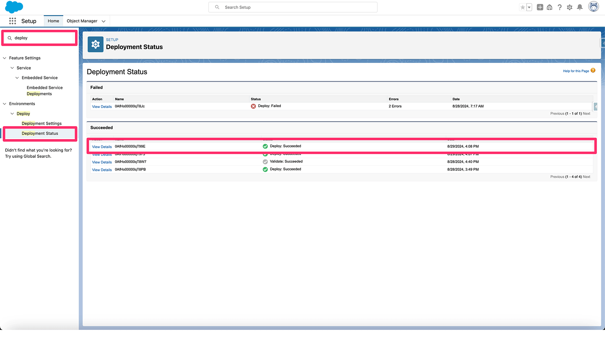
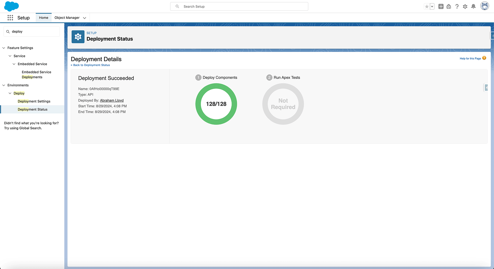

# cuneiformsf-reports

## Free Data Quality Reports for Salesforce Customers
Over 100+ Salesforce Reports spanning 17 Data Reliability Categories. 100% Free for Salesforce customers.

### Deploy the Reports to Your Target Org
To deploy the reports to your Salesforce org, you can use the following command in your terminal.
> ```bash sf project deploy start --source-dir=force-app/main/default```

This command will deploy the reports to your Salesforce org.  The following sample output depicts a successful deployment via SFDX.

```bash
fdm@adminCuneiform cuneiformsf-reports % sf project deploy start --source-dir=force-app/main/default
Deploying v61.0 metadata to sfdx@cuneiform.reports using the v61.0 SOAP API.
Deploy ID: 0AfHq10001zT9Y9YAY
Status: Succeeded | ████████████████████████████████████████ | 128/128 Components

Deployed Source
=================================================================================================================================================================================================================================================================
| State   Name                                                                                          Type         Path                                                                                                                                         
| ─────── ───────────────────────────────────────────────────────────────────────────────────────────── ──────────── ──────────────────────────────────────────────────────────────────────────────────────────────────────────────────────────────────────────── 
| Changed CuneiformforCRMDataHealthReports/DataAnalysisTemplates/Fields_DefaultValues_TEMPLATE          Report       force-app/main/default/reports/CuneiformforCRMDataHealthReports/DataAnalysisTemplates/Fields_DefaultValues_TEMPLATE.report-meta.xml          
| Changed CuneiformforCRMDataHealthReports/DataAnalysisTemplates/Object_RecordTypes_TEMPLATE            Report       force-app/main/default/reports/CuneiformforCRMDataHealthReports/DataAnalysisTemplates/Object_RecordTypes_TEMPLATE.report-meta.xml            
| Changed CuneiformforCRMDataHealthReports/DataAnalysisTemplates/ProfiledObject_Results_TEMPLATE        Report       force-app/main/default/reports/CuneiformforCRMDataHealthReports/DataAnalysisTemplates/ProfiledObject_Results_TEMPLATE.report-meta.xml        
| Changed CuneiformforCRMDataHealthReports/DataAnalysisTemplates/Profiled_FieldResults_TEMPLATE         Report       force-app/main/default/reports/CuneiformforCRMDataHealthReports/DataAnalysisTemplates/Profiled_FieldResults_TEMPLATE.report-meta.xml         
| Changed CuneiformforCRMDataHealthReports/DataAnalysisTemplates/Profiled_FieldValues_TEMPLATE          Report       force-app/main/default/reports/CuneiformforCRMDataHealthReports/DataAnalysisTemplates/Profiled_FieldValues_TEMPLATE.report-meta.xml          
| Changed CuneiformforCRMDataHealthReports/DataAnalysisTemplates/Profiled_PicklistValues_TEMPLATE       Report       force-app/main/default/reports/CuneiformforCRMDataHealthReports/DataAnalysisTemplates/Profiled_PicklistValues_TEMPLATE.report-meta.xml       
| Changed CuneiformforCRMDataHealthReports/DataAnalysisTemplates/ProfilingExceptionLogs_TEMPLATE        Report       force-app/main/default/reports/CuneiformforCRMDataHealthReports/DataAnalysisTemplates/ProfilingExceptionLogs_TEMPLATE.report-meta.xml        
| Changed CuneiformforCRMDataHealthReports/FieldsDataDictionary/Fields_Custom_NoDescriptions            Report       force-app/main/default/reports/CuneiformforCRMDataHealthReports/FieldsDataDictionary/Fields_Custom_NoDescriptions.report-meta.xml            
| Changed CuneiformforCRMDataHealthReports/FieldsDataDictionary/Fields_Custom_WithDescription           Report       force-app/main/default/reports/CuneiformforCRMDataHealthReports/FieldsDataDictionary/Fields_Custom_WithDescription.report-meta.xml           
| Changed CuneiformforCRMDataHealthReports/FieldsDataDictionary/Fields_DataGov_WithDescriptions         Report       force-app/main/default/reports/CuneiformforCRMDataHealthReports/FieldsDataDictionary/Fields_DataGov_WithDescriptions.report-meta.xml         
| Changed CuneiformforCRMDataHealthReports/FieldsDataDictionary/Fields_DictionaryDetails                Report       force-app/main/default/reports/CuneiformforCRMDataHealthReports/FieldsDataDictionary/Fields_DictionaryDetails.report-meta.xml                
| Changed CuneiformforCRMDataHealthReports/FieldsDataDictionary/Fields_Formulas_NoDescriptions          Report       force-app/main/default/reports/CuneiformforCRMDataHealthReports/FieldsDataDictionary/Fields_Formulas_NoDescriptions.report-meta.xml          
| Changed CuneiformforCRMDataHealthReports/FieldsDataDictionary/Fields_Governace_NoDescriptions         Report       force-app/main/default/reports/CuneiformforCRMDataHealthReports/FieldsDataDictionary/Fields_Governace_NoDescriptions.report-meta.xml         
| Changed CuneiformforCRMDataHealthReports/FieldsDataDictionary/Fields_NoDescriptions                   Report       force-app/main/default/reports/CuneiformforCRMDataHealthReports/FieldsDataDictionary/Fields_NoDescriptions.report-meta.xml                   
| Changed CuneiformforCRMDataHealthReports/FieldsDataDictionary/Fields_No_HelpText                      Report       force-app/main/default/reports/CuneiformforCRMDataHealthReports/FieldsDataDictionary/Fields_No_HelpText.report-meta.xml                      
| Changed CuneiformforCRMDataHealthReports/FieldsDataDictionary/Fields_With_Descriptions_HelpText       Report       force-app/main/default/reports/CuneiformforCRMDataHealthReports/FieldsDataDictionary/Fields_With_Descriptions_HelpText.report-meta.xml       
| Changed CuneiformforCRMDataHealthReports/FieldsDataDictionary/Fields_With_HelpText                    Report       force-app/main/default/reports/CuneiformforCRMDataHealthReports/FieldsDataDictionary/Fields_With_HelpText.report-meta.xml                    
| Changed CuneiformforCRMDataHealthReports/FieldsDataDictionary/Fields_Without_Descriptions_HelpText    Report       force-app/main/default/reports/CuneiformforCRMDataHealthReports/FieldsDataDictionary/Fields_Without_Descriptions_HelpText.report-meta.xml    
| Changed CuneiformforCRMDataHealthReports/FieldsDataGovernance/Fields_DataGov_ComplianceCategory       Report       force-app/main/default/reports/CuneiformforCRMDataHealthReports/FieldsDataGovernance/Fields_DataGov_ComplianceCategory.report-meta.xml       
| Changed CuneiformforCRMDataHealthReports/FieldsDataGovernance/Fields_DataGov_DataOwner                Report       force-app/main/default/reports/CuneiformforCRMDataHealthReports/FieldsDataGovernance/Fields_DataGov_DataOwner.report-meta.xml                
| Changed CuneiformforCRMDataHealthReports/FieldsDataGovernance/Fields_DataGov_FieldUsage               Report       force-app/main/default/reports/CuneiformforCRMDataHealthReports/FieldsDataGovernance/Fields_DataGov_FieldUsage.report-meta.xml               
| Changed CuneiformforCRMDataHealthReports/FieldsDataGovernance/Fields_DataGov_SensitivityLevel         Report       force-app/main/default/reports/CuneiformforCRMDataHealthReports/FieldsDataGovernance/Fields_DataGov_SensitivityLevel.report-meta.xml         
| Changed CuneiformforCRMDataHealthReports/FieldsDataGovernance/Fields_NoDataGovernance                 Report       force-app/main/default/reports/CuneiformforCRMDataHealthReports/FieldsDataGovernance/Fields_NoDataGovernance.report-meta.xml                 
| Changed CuneiformforCRMDataHealthReports/FieldsDataGovernance/Fields_WithDataGoverance                Report       force-app/main/default/reports/CuneiformforCRMDataHealthReports/FieldsDataGovernance/Fields_WithDataGoverance.report-meta.xml                
| Changed CuneiformforCRMDataHealthReports/FieldsDefaultValues/Fields_DataType_DefaultValues            Report       force-app/main/default/reports/CuneiformforCRMDataHealthReports/FieldsDefaultValues/Fields_DataType_DefaultValues.report-meta.xml            
| Changed CuneiformforCRMDataHealthReports/FieldsDefaultValues/Fields_DefaultValueUsage                 Report       force-app/main/default/reports/CuneiformforCRMDataHealthReports/FieldsDefaultValues/Fields_DefaultValueUsage.report-meta.xml                 
| Changed CuneiformforCRMDataHealthReports/FieldsDefaultValues/Fields_High_DefaultValueUsage            Report       force-app/main/default/reports/CuneiformforCRMDataHealthReports/FieldsDefaultValues/Fields_High_DefaultValueUsage.report-meta.xml            
| Changed CuneiformforCRMDataHealthReports/FieldsDefaultValues/Fields_OnlyUsing_DefaultValues           Report       force-app/main/default/reports/CuneiformforCRMDataHealthReports/FieldsDefaultValues/Fields_OnlyUsing_DefaultValues.report-meta.xml           
| Changed CuneiformforCRMDataHealthReports/FieldsDefaultValues/Fields_Required_DefaultValueUsage        Report       force-app/main/default/reports/CuneiformforCRMDataHealthReports/FieldsDefaultValues/Fields_Required_DefaultValueUsage.report-meta.xml        
| Changed CuneiformforCRMDataHealthReports/FieldsDuplicates/Fields_DupeDensity_HighImpact               Report       force-app/main/default/reports/CuneiformforCRMDataHealthReports/FieldsDuplicates/Fields_DupeDensity_HighImpact.report-meta.xml               
| Changed CuneiformforCRMDataHealthReports/FieldsDuplicates/Fields_Dupes_OverallvsPopulated             Report       force-app/main/default/reports/CuneiformforCRMDataHealthReports/FieldsDuplicates/Fields_Dupes_OverallvsPopulated.report-meta.xml             
| Changed CuneiformforCRMDataHealthReports/FieldsDuplicates/Fields_DuplicateDensity_Population          Report       force-app/main/default/reports/CuneiformforCRMDataHealthReports/FieldsDuplicates/Fields_DuplicateDensity_Population.report-meta.xml          
| Changed CuneiformforCRMDataHealthReports/FieldsDuplicates/Fields_Overall_DuplicateDensity             Report       force-app/main/default/reports/CuneiformforCRMDataHealthReports/FieldsDuplicates/Fields_Overall_DuplicateDensity.report-meta.xml             
| Changed CuneiformforCRMDataHealthReports/FieldsMetadataDependencies/CustomFields_All_ReportMDD        Report       force-app/main/default/reports/CuneiformforCRMDataHealthReports/FieldsMetadataDependencies/CustomFields_All_ReportMDD.report-meta.xml        
| Changed CuneiformforCRMDataHealthReports/FieldsMetadataDependencies/CustomFields_All_TotalMDD         Report       force-app/main/default/reports/CuneiformforCRMDataHealthReports/FieldsMetadataDependencies/CustomFields_All_TotalMDD.report-meta.xml         
| Changed CuneiformforCRMDataHealthReports/FieldsMetadataDependencies/CustomFields_All_UXMDD            Report       force-app/main/default/reports/CuneiformforCRMDataHealthReports/FieldsMetadataDependencies/CustomFields_All_UXMDD.report-meta.xml            
| Changed CuneiformforCRMDataHealthReports/FieldsMetadataDependencies/CustomFields_All_WorkFlowMDD      Report       force-app/main/default/reports/CuneiformforCRMDataHealthReports/FieldsMetadataDependencies/CustomFields_All_WorkFlowMDD.report-meta.xml      
| Changed CuneiformforCRMDataHealthReports/FieldsMetadataDependencies/CustomFields_Empty_RPTMDD         Report       force-app/main/default/reports/CuneiformforCRMDataHealthReports/FieldsMetadataDependencies/CustomFields_Empty_RPTMDD.report-meta.xml         
| Changed CuneiformforCRMDataHealthReports/FieldsMetadataDependencies/CustomFields_Empty_WorkFlowMDD    Report       force-app/main/default/reports/CuneiformforCRMDataHealthReports/FieldsMetadataDependencies/CustomFields_Empty_WorkFlowMDD.report-meta.xml    
| Changed CuneiformforCRMDataHealthReports/FieldsMetadataDependencies/Fields_EmptyWithDependenciesTotal Report       force-app/main/default/reports/CuneiformforCRMDataHealthReports/FieldsMetadataDependencies/Fields_EmptyWithDependenciesTotal.report-meta.xml 
| Changed CuneiformforCRMDataHealthReports/FieldsMetadataDependencies/Fields_Empty_UXMDD                Report       force-app/main/default/reports/CuneiformforCRMDataHealthReports/FieldsMetadataDependencies/Fields_Empty_UXMDD.report-meta.xml                
| Changed CuneiformforCRMDataHealthReports/FieldsMetadataDependencies/Fields_Empty_ValidationRules      Report       force-app/main/default/reports/CuneiformforCRMDataHealthReports/FieldsMetadataDependencies/Fields_Empty_ValidationRules.report-meta.xml      
| Changed CuneiformforCRMDataHealthReports/FieldsNamespaces/FieldUtilization_Namespace                  Report       force-app/main/default/reports/CuneiformforCRMDataHealthReports/FieldsNamespaces/FieldUtilization_Namespace.report-meta.xml                  
| Changed CuneiformforCRMDataHealthReports/FieldsNamespaces/Fields_Namespace_Empty                      Report       force-app/main/default/reports/CuneiformforCRMDataHealthReports/FieldsNamespaces/Fields_Namespace_Empty.report-meta.xml                      
| Changed CuneiformforCRMDataHealthReports/FieldsNamespaces/NamespaceFields_Object                      Report       force-app/main/default/reports/CuneiformforCRMDataHealthReports/FieldsNamespaces/NamespaceFields_Object.report-meta.xml                      
| Changed CuneiformforCRMDataHealthReports/FieldsNamespaces/PopulatedFields_Namespace                   Report       force-app/main/default/reports/CuneiformforCRMDataHealthReports/FieldsNamespaces/PopulatedFields_Namespace.report-meta.xml                   
| Changed CuneiformforCRMDataHealthReports/FieldsNamespaces/ProfiledFields_Namespace                    Report       force-app/main/default/reports/CuneiformforCRMDataHealthReports/FieldsNamespaces/ProfiledFields_Namespace.report-meta.xml                    
| Changed CuneiformforCRMDataHealthReports/FieldsNamespaces/ProfiledObjects_Namespace                   Report       force-app/main/default/reports/CuneiformforCRMDataHealthReports/FieldsNamespaces/ProfiledObjects_Namespace.report-meta.xml                   
| Changed CuneiformforCRMDataHealthReports/FieldsObjectReferences/ObjectReferences_ParentObjects        Report       force-app/main/default/reports/CuneiformforCRMDataHealthReports/FieldsObjectReferences/ObjectReferences_ParentObjects.report-meta.xml        
| Changed CuneiformforCRMDataHealthReports/FieldsObjectReferences/ObjectReferences_PopReference         Report       force-app/main/default/reports/CuneiformforCRMDataHealthReports/FieldsObjectReferences/ObjectReferences_PopReference.report-meta.xml         
| Changed CuneiformforCRMDataHealthReports/FieldsObjectReferences/ObjectReferences_ReferenceField       Report       force-app/main/default/reports/CuneiformforCRMDataHealthReports/FieldsObjectReferences/ObjectReferences_ReferenceField.report-meta.xml       
| Changed CuneiformforCRMDataHealthReports/FieldsObjectReferences/ReferenceFields_Empty_Object          Report       force-app/main/default/reports/CuneiformforCRMDataHealthReports/FieldsObjectReferences/ReferenceFields_Empty_Object.report-meta.xml          
| Changed CuneiformforCRMDataHealthReports/FieldsObjectReferences/ReferenceFields_EmptyvsPopulated      Report       force-app/main/default/reports/CuneiformforCRMDataHealthReports/FieldsObjectReferences/ReferenceFields_EmptyvsPopulated.report-meta.xml      
| Changed CuneiformforCRMDataHealthReports/FieldsObjectReferences/ReferenceFields_FieldValues           Report       force-app/main/default/reports/CuneiformforCRMDataHealthReports/FieldsObjectReferences/ReferenceFields_FieldValues.report-meta.xml           
| Changed CuneiformforCRMDataHealthReports/FieldsObjectReferences/ReferenceFields_ParentObject          Report       force-app/main/default/reports/CuneiformforCRMDataHealthReports/FieldsObjectReferences/ReferenceFields_ParentObject.report-meta.xml          
| Changed CuneiformforCRMDataHealthReports/FieldsOutlierValues/FieldValue_OutlierFrequency              Report       force-app/main/default/reports/CuneiformforCRMDataHealthReports/FieldsOutlierValues/FieldValue_OutlierFrequency.report-meta.xml              
| Changed CuneiformforCRMDataHealthReports/FieldsOutlierValues/FieldValues_OutlierDetails               Report       force-app/main/default/reports/CuneiformforCRMDataHealthReports/FieldsOutlierValues/FieldValues_OutlierDetails.report-meta.xml               
| Changed CuneiformforCRMDataHealthReports/FieldsPicklistValues/Field_PicklistConversion_Candidates     Report       force-app/main/default/reports/CuneiformforCRMDataHealthReports/FieldsPicklistValues/Field_PicklistConversion_Candidates.report-meta.xml     
| Changed CuneiformforCRMDataHealthReports/FieldsPicklistValues/PicklistFields_ActiveValues_InUse       Report       force-app/main/default/reports/CuneiformforCRMDataHealthReports/FieldsPicklistValues/PicklistFields_ActiveValues_InUse.report-meta.xml       
| Changed CuneiformforCRMDataHealthReports/FieldsPicklistValues/Picklist_Fields_ActiveValues_NotUsed    Report       force-app/main/default/reports/CuneiformforCRMDataHealthReports/FieldsPicklistValues/Picklist_Fields_ActiveValues_NotUsed.report-meta.xml    
| Changed CuneiformforCRMDataHealthReports/FieldsPicklistValues/Picklist_Fields_InactiveValues_InUse    Report       force-app/main/default/reports/CuneiformforCRMDataHealthReports/FieldsPicklistValues/Picklist_Fields_InactiveValues_InUse.report-meta.xml    
| Changed CuneiformforCRMDataHealthReports/FieldsPicklistValues/Picklist_Fields_UnusedValues            Report       force-app/main/default/reports/CuneiformforCRMDataHealthReports/FieldsPicklistValues/Picklist_Fields_UnusedValues.report-meta.xml            
| Changed CuneiformforCRMDataHealthReports/FieldsPopulationLow/LowPopulationFields_All                  Report       force-app/main/default/reports/CuneiformforCRMDataHealthReports/FieldsPopulationLow/LowPopulationFields_All.report-meta.xml                  
| Changed CuneiformforCRMDataHealthReports/FieldsPopulationLow/LowPopulationFields_Formulas             Report       force-app/main/default/reports/CuneiformforCRMDataHealthReports/FieldsPopulationLow/LowPopulationFields_Formulas.report-meta.xml             
| Changed CuneiformforCRMDataHealthReports/FieldsPopulationLow/LowPopulationFields_NoDescription        Report       force-app/main/default/reports/CuneiformforCRMDataHealthReports/FieldsPopulationLow/LowPopulationFields_NoDescription.report-meta.xml        
| Changed CuneiformforCRMDataHealthReports/FieldsPopulationLow/LowPopulationFields_NoGovernance         Report       force-app/main/default/reports/CuneiformforCRMDataHealthReports/FieldsPopulationLow/LowPopulationFields_NoGovernance.report-meta.xml         
| Changed CuneiformforCRMDataHealthReports/FieldsPopulationLow/LowPopulationFields_Orphaned             Report       force-app/main/default/reports/CuneiformforCRMDataHealthReports/FieldsPopulationLow/LowPopulationFields_Orphaned.report-meta.xml             
| Changed CuneiformforCRMDataHealthReports/FieldsPopulationLow/LowPopulationFields_Relationships        Report       force-app/main/default/reports/CuneiformforCRMDataHealthReports/FieldsPopulationLow/LowPopulationFields_Relationships.report-meta.xml        
| Changed CuneiformforCRMDataHealthReports/FieldsProfilingSegments/Potential_ProfilingSegments          Report       force-app/main/default/reports/CuneiformforCRMDataHealthReports/FieldsProfilingSegments/Potential_ProfilingSegments.report-meta.xml          
| Changed CuneiformforCRMDataHealthReports/FieldsProfilingSegments/Profiling_SegmentFields_PopValues    Report       force-app/main/default/reports/CuneiformforCRMDataHealthReports/FieldsProfilingSegments/Profiling_SegmentFields_PopValues.report-meta.xml    
| Changed CuneiformforCRMDataHealthReports/FieldsProfilingSegments/Profiling_SegmentFields_SegmentScore Report       force-app/main/default/reports/CuneiformforCRMDataHealthReports/FieldsProfilingSegments/Profiling_SegmentFields_SegmentScore.report-meta.xml 
| Changed CuneiformforCRMDataHealthReports/FieldsProfilingSegments/Profiling_SegmentValues_ByObject     Report       force-app/main/default/reports/CuneiformforCRMDataHealthReports/FieldsProfilingSegments/Profiling_SegmentValues_ByObject.report-meta.xml     
| Changed CuneiformforCRMDataHealthReports/FieldsRecordTypes/Profiled_RecordTypes_Populated             Report       force-app/main/default/reports/CuneiformforCRMDataHealthReports/FieldsRecordTypes/Profiled_RecordTypes_Populated.report-meta.xml             
| Changed CuneiformforCRMDataHealthReports/FieldsRecordTypes/Profiled_RecordTypes_PopulationRate        Report       force-app/main/default/reports/CuneiformforCRMDataHealthReports/FieldsRecordTypes/Profiled_RecordTypes_PopulationRate.report-meta.xml        
| Changed CuneiformforCRMDataHealthReports/FieldsRecordTypes/RecordTypes_PopPcValues_Stacked            Report       force-app/main/default/reports/CuneiformforCRMDataHealthReports/FieldsRecordTypes/RecordTypes_PopPcValues_Stacked.report-meta.xml            
| Changed CuneiformforCRMDataHealthReports/FieldsUnpopulated/EmptyFields_Abandoned                      Report       force-app/main/default/reports/CuneiformforCRMDataHealthReports/FieldsUnpopulated/EmptyFields_Abandoned.report-meta.xml                      
| Changed CuneiformforCRMDataHealthReports/FieldsUnpopulated/EmptyFields_All                            Report       force-app/main/default/reports/CuneiformforCRMDataHealthReports/FieldsUnpopulated/EmptyFields_All.report-meta.xml                            
| Changed CuneiformforCRMDataHealthReports/FieldsUnpopulated/EmptyFields_Formulas                       Report       force-app/main/default/reports/CuneiformforCRMDataHealthReports/FieldsUnpopulated/EmptyFields_Formulas.report-meta.xml                       
| Changed CuneiformforCRMDataHealthReports/FieldsUnpopulated/EmptyFields_NoDesc                         Report       force-app/main/default/reports/CuneiformforCRMDataHealthReports/FieldsUnpopulated/EmptyFields_NoDesc.report-meta.xml                         
| Changed CuneiformforCRMDataHealthReports/FieldsUnpopulated/EmptyFields_NoDescHelpText                 Report       force-app/main/default/reports/CuneiformforCRMDataHealthReports/FieldsUnpopulated/EmptyFields_NoDescHelpText.report-meta.xml                 
| Changed CuneiformforCRMDataHealthReports/FieldsUnpopulated/EmptyFields_NoGovernance                   Report       force-app/main/default/reports/CuneiformforCRMDataHealthReports/FieldsUnpopulated/EmptyFields_NoGovernance.report-meta.xml                   
| Changed CuneiformforCRMDataHealthReports/FieldsUnpopulated/EmptyFields_Relationships                  Report       force-app/main/default/reports/CuneiformforCRMDataHealthReports/FieldsUnpopulated/EmptyFields_Relationships.report-meta.xml                  
| Changed CuneiformforCRMDataHealthReports/IdentityResolution/AddressValues_Less10Characters            Report       force-app/main/default/reports/CuneiformforCRMDataHealthReports/IdentityResolution/AddressValues_Less10Characters.report-meta.xml            
| Changed CuneiformforCRMDataHealthReports/IdentityResolution/FrequentValues_AddressFields              Report       force-app/main/default/reports/CuneiformforCRMDataHealthReports/IdentityResolution/FrequentValues_AddressFields.report-meta.xml              
| Changed CuneiformforCRMDataHealthReports/IdentityResolution/FrequentValues_Phone_DataType             Report       force-app/main/default/reports/CuneiformforCRMDataHealthReports/IdentityResolution/FrequentValues_Phone_DataType.report-meta.xml             
| Changed CuneiformforCRMDataHealthReports/IdentityResolution/FrequentValues_Url_DataType               Report       force-app/main/default/reports/CuneiformforCRMDataHealthReports/IdentityResolution/FrequentValues_Url_DataType.report-meta.xml               
| Changed CuneiformforCRMDataHealthReports/IdentityResolution/IdentityResolutionFields_Object           Report       force-app/main/default/reports/CuneiformforCRMDataHealthReports/IdentityResolution/IdentityResolutionFields_Object.report-meta.xml           
| Changed CuneiformforCRMDataHealthReports/IdentityResolution/IdentityResolutionFields_Populated        Report       force-app/main/default/reports/CuneiformforCRMDataHealthReports/IdentityResolution/IdentityResolutionFields_Populated.report-meta.xml        
| Changed CuneiformforCRMDataHealthReports/IdentityResolution/IdentityResolution_FieldsDistinct         Report       force-app/main/default/reports/CuneiformforCRMDataHealthReports/IdentityResolution/IdentityResolution_FieldsDistinct.report-meta.xml         
| Changed CuneiformforCRMDataHealthReports/IdentityResolution/IdentityResolution_PrioritizedFields      Report       force-app/main/default/reports/CuneiformforCRMDataHealthReports/IdentityResolution/IdentityResolution_PrioritizedFields.report-meta.xml      
| Changed CuneiformforCRMDataHealthReports/IdentityResolution/Identity_PopDistinct_Rates                Report       force-app/main/default/reports/CuneiformforCRMDataHealthReports/IdentityResolution/Identity_PopDistinct_Rates.report-meta.xml                
| Changed CuneiformforCRMDataHealthReports/IdentityResolution/Identity_ResFields_CleanUpValues          Report       force-app/main/default/reports/CuneiformforCRMDataHealthReports/IdentityResolution/Identity_ResFields_CleanUpValues.report-meta.xml          
| Changed CuneiformforCRMDataHealthReports/IdentityResolution/Identity_ResolutionFields_DataType        Report       force-app/main/default/reports/CuneiformforCRMDataHealthReports/IdentityResolution/Identity_ResolutionFields_DataType.report-meta.xml        
| Changed CuneiformforCRMDataHealthReports/IdentityResolution/MostFrequentValues_Email_DataType         Report       force-app/main/default/reports/CuneiformforCRMDataHealthReports/IdentityResolution/MostFrequentValues_Email_DataType.report-meta.xml         
| Changed CuneiformforCRMDataHealthReports/IdentityResolution/PhoneValues_Less10Characters              Report       force-app/main/default/reports/CuneiformforCRMDataHealthReports/IdentityResolution/PhoneValues_Less10Characters.report-meta.xml              
| Changed CuneiformforCRMDataHealthReports/IdentityResolution/ResolutionFields_MatchCandidates          Report       force-app/main/default/reports/CuneiformforCRMDataHealthReports/IdentityResolution/ResolutionFields_MatchCandidates.report-meta.xml          
| Changed CuneiformforCRMDataHealthReports/OwnerCreatorandModifier/Creators_ProfiledObjects             Report       force-app/main/default/reports/CuneiformforCRMDataHealthReports/OwnerCreatorandModifier/Creators_ProfiledObjects.report-meta.xml             
| Changed CuneiformforCRMDataHealthReports/OwnerCreatorandModifier/Modifiers_ProfiledObjects            Report       force-app/main/default/reports/CuneiformforCRMDataHealthReports/OwnerCreatorandModifier/Modifiers_ProfiledObjects.report-meta.xml            
| Changed CuneiformforCRMDataHealthReports/OwnerCreatorandModifier/Owners_ProfiledObjects               Report       force-app/main/default/reports/CuneiformforCRMDataHealthReports/OwnerCreatorandModifier/Owners_ProfiledObjects.report-meta.xml               
| Changed CuneiformforCRMDataHealthReports/OwnerCreatorandModifier/Top_RecordCreators_Object            Report       force-app/main/default/reports/CuneiformforCRMDataHealthReports/OwnerCreatorandModifier/Top_RecordCreators_Object.report-meta.xml            
| Changed CuneiformforCRMDataHealthReports/OwnerCreatorandModifier/Top_RecordModifiers_Object           Report       force-app/main/default/reports/CuneiformforCRMDataHealthReports/OwnerCreatorandModifier/Top_RecordModifiers_Object.report-meta.xml           
| Changed CuneiformforCRMDataHealthReports/OwnerCreatorandModifier/Top_RecordOwners_Object              Report       force-app/main/default/reports/CuneiformforCRMDataHealthReports/OwnerCreatorandModifier/Top_RecordOwners_Object.report-meta.xml              
| Changed CuneiformforCRMDataHealthReports/ProfilingExceptions/ExceptionLogs_Classes_Definitions        Report       force-app/main/default/reports/CuneiformforCRMDataHealthReports/ProfilingExceptions/ExceptionLogs_Classes_Definitions.report-meta.xml        
| Changed CuneiformforCRMDataHealthReports/ProfilingExceptions/ExceptionLogs_Definitions                Report       force-app/main/default/reports/CuneiformforCRMDataHealthReports/ProfilingExceptions/ExceptionLogs_Definitions.report-meta.xml                
| Changed CuneiformforCRMDataHealthReports/ProfilingExceptions/ExceptionLogs_Field                      Report       force-app/main/default/reports/CuneiformforCRMDataHealthReports/ProfilingExceptions/ExceptionLogs_Field.report-meta.xml                      
| Changed CuneiformforCRMDataHealthReports/ProfilingExceptions/ExceptionLogs_Fields_Definitions         Report       force-app/main/default/reports/CuneiformforCRMDataHealthReports/ProfilingExceptions/ExceptionLogs_Fields_Definitions.report-meta.xml         
| Changed CuneiformforCRMDataHealthReports/ProfilingExceptions/ExceptionLogs_Object                     Report       force-app/main/default/reports/CuneiformforCRMDataHealthReports/ProfilingExceptions/ExceptionLogs_Object.report-meta.xml                     
| Changed CuneiformforCRMDataHealthReports/ProfilingExceptions/ExceptionLogs_Object_Field               Report       force-app/main/default/reports/CuneiformforCRMDataHealthReports/ProfilingExceptions/ExceptionLogs_Object_Field.report-meta.xml               
| Changed CuneiformforCRMDataHealthReports/ProfilingExceptions/ExceptionLogs_Unassociated               Report       force-app/main/default/reports/CuneiformforCRMDataHealthReports/ProfilingExceptions/ExceptionLogs_Unassociated.report-meta.xml               
| Changed CuneiformforCRMDataHealthReports/ProfilingExceptions/ExceptionLogs_Unassociated_Class         Report       force-app/main/default/reports/CuneiformforCRMDataHealthReports/ProfilingExceptions/ExceptionLogs_Unassociated_Class.report-meta.xml         
| Created CuneiformforCRMDataHealthReports                                                              ReportFolder force-app/main/default/reports/CuneiformforCRMDataHealthReports.reportFolder-meta.xml                                                        
| Created CuneiformforCRMDataHealthReports/DataAnalysisTemplates                                        ReportFolder force-app/main/default/reports/CuneiformforCRMDataHealthReports/DataAnalysisTemplates.reportFolder-meta.xml                                  
| Created CuneiformforCRMDataHealthReports/FieldsDataDictionary                                         ReportFolder force-app/main/default/reports/CuneiformforCRMDataHealthReports/FieldsDataDictionary.reportFolder-meta.xml                                   
| Created CuneiformforCRMDataHealthReports/FieldsDataGovernance                                         ReportFolder force-app/main/default/reports/CuneiformforCRMDataHealthReports/FieldsDataGovernance.reportFolder-meta.xml                                   
| Created CuneiformforCRMDataHealthReports/FieldsDefaultValues                                          ReportFolder force-app/main/default/reports/CuneiformforCRMDataHealthReports/FieldsDefaultValues.reportFolder-meta.xml                                    
| Created CuneiformforCRMDataHealthReports/FieldsDuplicates                                             ReportFolder force-app/main/default/reports/CuneiformforCRMDataHealthReports/FieldsDuplicates.reportFolder-meta.xml                                       
| Created CuneiformforCRMDataHealthReports/FieldsMetadataDependencies                                   ReportFolder force-app/main/default/reports/CuneiformforCRMDataHealthReports/FieldsMetadataDependencies.reportFolder-meta.xml                             
| Created CuneiformforCRMDataHealthReports/FieldsNamespaces                                             ReportFolder force-app/main/default/reports/CuneiformforCRMDataHealthReports/FieldsNamespaces.reportFolder-meta.xml                                       
| Created CuneiformforCRMDataHealthReports/FieldsObjectReferences                                       ReportFolder force-app/main/default/reports/CuneiformforCRMDataHealthReports/FieldsObjectReferences.reportFolder-meta.xml                                 
| Created CuneiformforCRMDataHealthReports/FieldsOutlierValues                                          ReportFolder force-app/main/default/reports/CuneiformforCRMDataHealthReports/FieldsOutlierValues.reportFolder-meta.xml                                    
| Created CuneiformforCRMDataHealthReports/FieldsPicklistValues                                         ReportFolder force-app/main/default/reports/CuneiformforCRMDataHealthReports/FieldsPicklistValues.reportFolder-meta.xml                                   
| Created CuneiformforCRMDataHealthReports/FieldsPopulationLow                                          ReportFolder force-app/main/default/reports/CuneiformforCRMDataHealthReports/FieldsPopulationLow.reportFolder-meta.xml                                    
| Created CuneiformforCRMDataHealthReports/FieldsProfilingSegments                                      ReportFolder force-app/main/default/reports/CuneiformforCRMDataHealthReports/FieldsProfilingSegments.reportFolder-meta.xml                                
| Created CuneiformforCRMDataHealthReports/FieldsRecordTypes                                            ReportFolder force-app/main/default/reports/CuneiformforCRMDataHealthReports/FieldsRecordTypes.reportFolder-meta.xml                                      
| Created CuneiformforCRMDataHealthReports/FieldsUnpopulated                                            ReportFolder force-app/main/default/reports/CuneiformforCRMDataHealthReports/FieldsUnpopulated.reportFolder-meta.xml                                      
| Created CuneiformforCRMDataHealthReports/IdentityResolution                                           ReportFolder force-app/main/default/reports/CuneiformforCRMDataHealthReports/IdentityResolution.reportFolder-meta.xml                                     
| Created CuneiformforCRMDataHealthReports/OwnerCreatorandModifier                                      ReportFolder force-app/main/default/reports/CuneiformforCRMDataHealthReports/OwnerCreatorandModifier.reportFolder-meta.xml                                
| Created CuneiformforCRMDataHealthReports/ProfilingExceptions                                          ReportFolder force-app/main/default/reports/CuneiformforCRMDataHealthReports/ProfilingExceptions.reportFolder-meta.xml  
```

### Verify Your Deployment via Salesforce Setup
You can verify the deployment by navigating to Deployment Status in Salesforce Setup.  The following screenshot depicts a successful deployment.



> From Setup, search for `deploy` in the quick-find box.  Click on `Deployment Status` to view the list of deployments.  In the Deployment Status display, select the deployment that aligns with the timestamp of your deployment (check the **Succeeded** section first -- followed by the **Failed** section).  Your deployment should be at or near the top of the list-views presented in this tab.



> The deployment details display depict the date and time of the deployment, the deployment status, the components that were deployed, and the deployment results.  It will also include any exceptions that were caught during the deployment process.

---

Return to the **[Cuneiform for Salesforce: Reports](README.md#verify-the-reports-in-your-salesforce-org)** repository overview.
